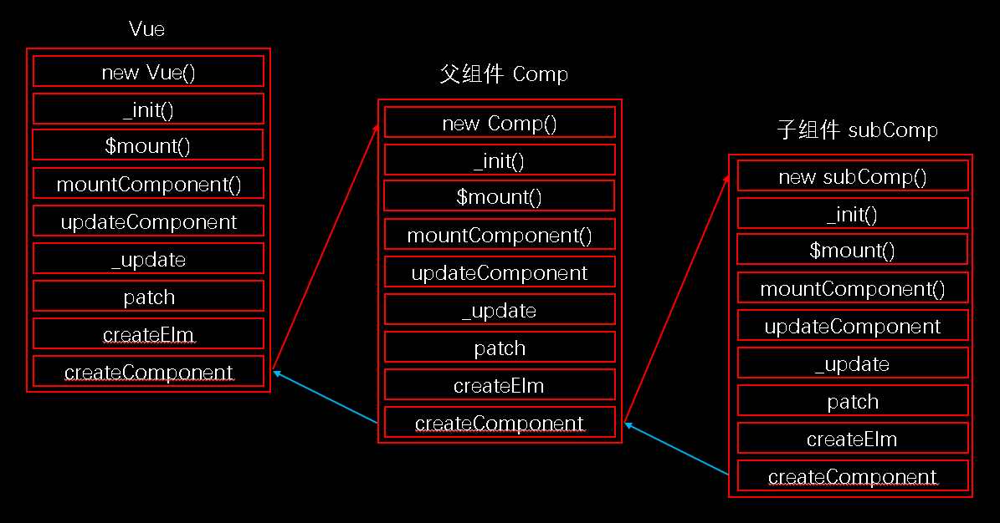

## 反馈问题

- vuex为什么刷新时候数据会丢失 老师能给我们分析一下背后的本质原因么

  

  ```js
  import store from './store'
  store.state //  ==> { count: 0, msg: 'Hello World' }
  
  
  
  import Vue from 'vue'
  import Vuex from 'vuex'
  
  Vue.use(Vuex)
  
  export default new Vuex.Store({
    state: {
      count: 0,
      msg: 'Hello World'
    },
    getters: {
      reverseMsg (state) {
        return state.msg.split('').reverse().join('')
      }
    },
    mutations: {
      increate (state, payload) {
        state.count += payload
      }
    },
    actions: {
      increateAsync (context, payload) {
        setTimeout(() => {
          context.commit('increate', payload)
        }, 2000)
      }
    }
  })
  ```

  

- 是不是一个组件就是一个Vue实例

  Vue.component()  	--> global-api/assets.js

  Vue.extend() 			--> global-api/extend.js

  VueComponent 继承自 Vue

  

- 源码中的 vm 是指输出的 new Vue() 还是指每个Vue组件

   

- 为什么Vue构造函数用function定义而不是class

- 组件中 data 为何是函数返回值的形式

  https://cn.vuejs.org/v2/guide/components.html

- 对 computed 和 watcher 的内在区别不太了解

  https://cn.vuejs.org/v2/api/#computed

  https://cn.vuejs.org/v2/api/#watch

- 父组件和子组件之间的消息传递和渲染逻辑是怎样的？

  - 组件的 props 传值过程

  src/core/instance/state.js 文件中的 initState 中初始化组件内部的 props

  - 组件创建和挂载过程

  core/vdom/create-component.js 中的

  createComponentInstanceForVnode 函数设置断点，创建实例的位置

  

  

  先创建父组件的实例，再创建子组件的实例。

  先挂载子组件，再挂载父组件。最终一起渲染到视图



## 发布

- Github Pages

  - 个人设置 - Personal access tokens
  - 项目 - Settings - Secrets
  - 本地项目，创建 .github/workflows/ci.yml
  - 本地项目，package.json 中增加
    - "homepage": "https://[用户名].github.io/[仓库名称]",
  - 本地项目，创建 vue.config.js

  ```js
  module.exports = {
    outputDir: 'dist',
    publicPath: process.env.NODE_ENV === 'production' ? '/github的仓库名称/' : '/'
  }
  ```

  - git 提交 git add   git commit
  - 设置 Github Pages  - 指定 gh-pages 分支
    - ci.yml

  ```yaml
  name: GitHub Actions Build and Deploy Demo
  on:
    push:
      branches:
        - master
  jobs:
    build-and-deploy:
      runs-on: ubuntu-latest
      steps:
      - name: Checkout
        uses: actions/checkout@master
      - name: Build and Deploy
        uses: JamesIves/github-pages-deploy-action@master
        env:
          ACCESS_TOKEN: ${{ secrets.ACCESS_TOKEN }}
          BRANCH: gh-pages
          FOLDER: dist
          BUILD_SCRIPT: npm install && npm run build
  # https://github.com/marketplace/actions/deploy-to-github-pages
  ```

- [Netlify](https://www.netlify.com/)

  - 可以在 https://github.com/marketplace 中找到现成的 actions

```yaml
# .github/workflows/netlify.yml
# https://github.com/marketplace/actions/netlify-actions
name: Build and Deploy to Netlify
on:
  push:
    branches:
      - master
  pull_request:
    types: [opened, synchronize]
jobs:
  build:
    runs-on: ubuntu-18.04
    steps:
      - uses: actions/checkout@v2

      # ( Build to ./dist or other directory... )
      - name: Build
        run:
          yarn && yarn build
      - name: Deploy to Netlify
        uses: nwtgck/actions-netlify@v1.1
        with:
          publish-dir: './dist'
          production-branch: master
          github-token: ${{ secrets.TOKENFORNETLIFY }}
          deploy-message: "Deploy from GitHub Actions"
          enable-pull-request-comment: false
          enable-commit-comment: true
          overwrites-pull-request-comment: true
        env:
          NETLIFY_AUTH_TOKEN: ${{ secrets.NETLIFY_AUTH_TOKEN }}
          NETLIFY_SITE_ID: ${{ secrets.NETLIFY_SITE_ID }}
        timeout-minutes: 1
```


- [Vercel](https://vercel.com)

  - https://nuxtjs.org/faq/now-deployment

  - 在 Vercel 的网站使用 github 账号登录

  - 全局安装 vercel
  
    ```bash
  yarn global add vercel
    ```

  - 创建配置文件 now.json or vercel.json
  
    ```json
    {
      "version": 2,
      "builds": [
        {
          "src": "nuxt.config.js",
          "use": "@nuxtjs/now-builder"
        }
      ]
  }
    ```

  - .nowignore

    忽略构建的文件夹 .nuxt
  
    ```
  .nuxt
    ```

  - 发布

    修改 package.json 中配置的端口，port 改成 80
  
    终端运行
    
  ```bash
    vercel
  # 修改完代码直接发布，他会在服务器上构建
    vercel --prod
    ```
    
    发布完毕后，首页是静态的，可以直接查看到，但是需要请求接口的地方，比如：登录 会出错。
    
    点击登录按钮的时候会在控制台提示，在https的主域名下访问接口的时候，接口地址也需要使用 https
    
  - 修改 baseUrl，把接口地址更改成 https 的
  
    在 plugins/request.js
  
    ```js
    export const request = axios.create({
      // baseURL: 'http://realworld.api.fed.lagounews.com'
      baseURL: 'https://conduit.productionready.io'
    })
    ```
  
    https://github.com/gothinkster/realworld-starter-kit/blob/master/FRONTEND_INSTRUCTIONS.md

## AST 抽象语法树

### AST

Abstract Syntax Tree 抽象语法树，简称 AST，是使用树状结构来描述源代码。

代码风格检查，代码转换(降级处理)，代码压缩，代码优化等，都使用到了 AST

webpack babel eslint 等工具在对代码处理的过程中都使用到了 AST

- https://astexplorer.net/
- https://esprima.org/demo/parse.html

### esprima 

https://esprima.org/

- esprima
  - 把 JavaScript 代码解析成 AST
- estraverse
  - 对抽象语法树进行遍历
- escodegen
  - AST 转换成 JavaScript 代码

```bash
yarn add esprima estraverse escodegen -D
```

- 把 const 转换成  var

```js
const esprima = require('esprima')
const estraverse = require('estraverse')
const escodegen = require('escodegen')

let code = 'const name = 19'

const ast = esprima.parseScript(code)

estraverse.traverse(ast, {
  enter (node) {
    // if (node.type === 'Identifier') {
    //   node.name = 'Hello'
    // }
    if (node.type === 'VariableDeclaration') {
      if (node.kind === 'const') {
        node.kind = 'var'
      }
    }
  },
  leave (node) {
  }
})

code = escodegen.generate(ast)
console.log(code)
```


### babel 插件

- 安装

```bash
yarn add @babel/core @babel/preset-env -D
```

- 转换箭头函数

```js
const path = require('path')
const babel = require('@babel/core')

let code = 'const fn = (a, b) =>  a + b '

let r = babel.transform(code, {
  // presets: ['@babel/preset-env']
  plugins: [
    '@babel/plugin-transform-arrow-functions',
    '@babel/plugin-transform-block-scoping'
  ]
})

// 加载文件转换代码
// let r = babel.transformFileSync(path.join(__dirname, 'index.js'), {
//   plugins: [
//     '@babel/plugin-transform-arrow-functions',
//     '@babel/plugin-transform-block-scoping'
//   ]
// })
console.log(r.code)
```

### 实现 babel 转换箭头函数的插件

- 实现的效果

```js
const fn = (a, b) => a + b
// ==>
var fn = function (a, b) => {
  return a + b
}
```

​	对比两次代码生成的 AST

- 访问者模式
  - babel 的插件中使用了访问者模式，就是在访问到某一个路径的时候进行匹配，然后修改该路径对应的节点。
  - 这里访问到 ArrowFunctionExpression，对 ArrowFunctionExpression 对应的节点进行修改

```js
const babel = require('@babel/core')

let code = 'const fn = (a, b) => a + b '

const arrayFnPlugin = {
  visitor: {
    ArrowFunctionExpression (path) {
      console.log(path.node)
    }
  }
}

let result = babel.transform(code, {
  plugins: [arrayFnPlugin]
})

console.log(result.code)
```

- 修改节点

  - 接下来要做的事情是生成一个 FunctionExpression 节点，替换掉 ArrowFunctionExpression 节点
  - 需要使用到 @babel/types，他可以帮我们生成想要的节点
  - 安装 @babel/core 的时候已经安装了 @babel/types
  - https://babeljs.io/docs/en/next/babel-types

  ```js
  const babel = require('@babel/core')
  const types = require('@babel/types')
  
  let code = 'const fn = (a, b) => a + b'
  
  const arrayFnPlugin = {
    visitor: {
      VariableDeclaration (path) {
        path.node.kind = 'var'
      },
      ArrowFunctionExpression (path) {
        // 记录下来当前的箭头函数对应的节点
        const node = path.node
        const params = node.params
        const id = path.parent.id
        const returnStatement = types.returnStatement(node.body)
        const blockStatement = types.blockStatement([returnStatement])
        // 创建 FunctionExpression
        const functionExpression = types.functionExpression(id, params, blockStatement)
        // 使用 fe 替换掉 afe
        path.replaceWith(functionExpression)
      }
    }
  }
  
  let result = babel.transform(code, {
    plugins: [arrayFnPlugin]
  })
  
  console.log(result.code)
  ```


