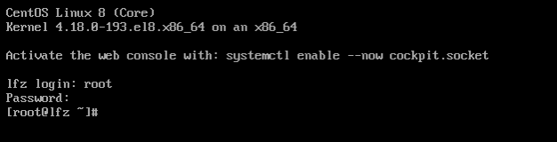
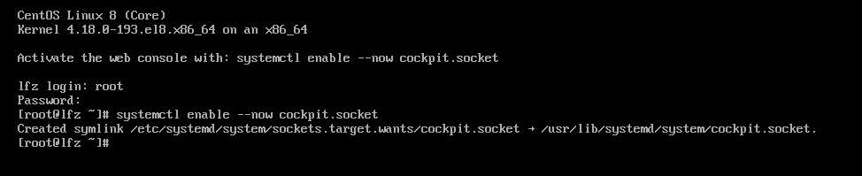
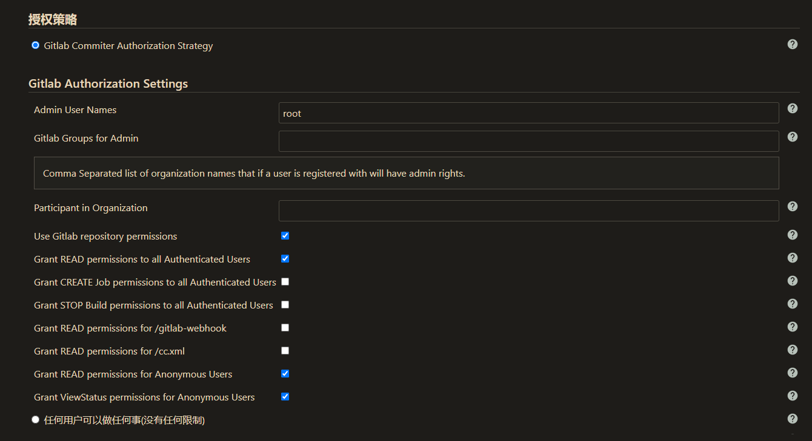
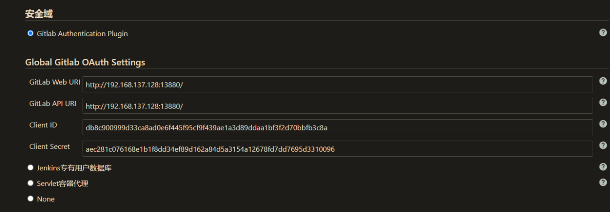
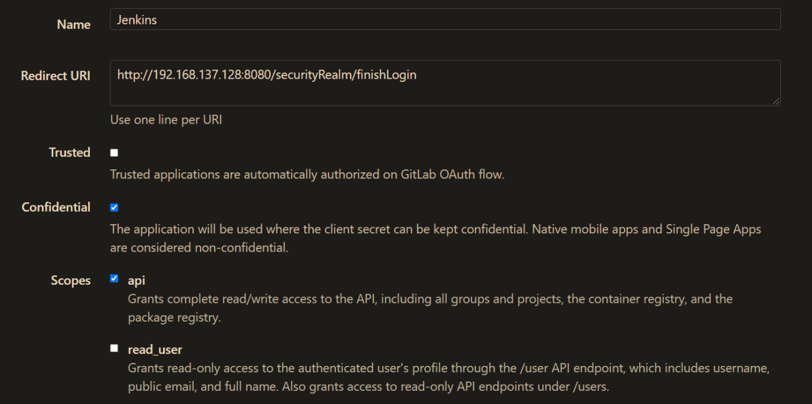
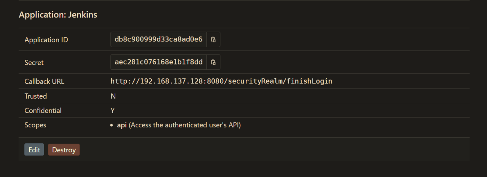

# Docker

## CentOS 8 
### CentOS 8 下载镜像

- [https://mirrors.aliyun.com/centos/8/isos/x86_64/](https://mirrors.aliyun.com/centos/8/isos/x86_64/)

 



### 宿主机配置 Host

```bash
# 查看虚拟机中的 IP
ip addr
```

C:\Windows\System32\drivers\etc\hosts
```bash
192.168.137.128 lfz.com
```
### 无法上网

```bash
cd /etc/sysconfig/network-scripts/
ls
vi ifcfg-ens33
```

```
BOOTPROTO=dhcp # 将dhcp修改为static表示使用静态ip
ONBOOT=yes # 将no改为yes
# 重启网卡
nmcli c reload ifcfg-ens33
```

- 给虚拟机的网卡共享本地连接

### 配置 ssh-key 免密登陆

```bash
cd C:\Users\Administrator\.ssh
ssh-keygen

# 客户机配置 config
# centos服务器上配置公钥
```


## Docker 简介

- [https://docs.docker.com/](https://docs.docker.com/)

```bash
docker run --name nginx-test -p 8080:80 -d nginx
```

```bash
docker run --rm -d -p 40001:3000 jayfong/yapi:play
# 默认的管理员账号：admin@docker.yapi，管理员密码：adm1n。
```

### 什么是 Docker

- Docker 是一个集打包、运行、测试、发布于一体的开放式平台
- 我们可以把开发过程中的基础设施分离出来部署到 Docker
   - DevOps：开发、构建、自动化部署、测试、文档
   - GitLib、Jenkins
   - Nginx、Apache
   - MySQL、MongoDb
   - 文档管理工具
- 使用 Docker 可以避免复杂的应用环境配置，并以秒级的速度开启
- 支持绝大多数平台，容器的性能开销极低
### Docker 应用场景

- Web 应用的自动化打包和发布
- 自动化测试和持续集成、发布
- 在服务型环境中部署和调整数据库或其他的后台应用
### Docker 核心概念

- Docker Daemon 守护进程
   - Docker Daemon 是 Docker 的守护进程
   - Docker Client 通过命令行与 Docker Damon 通信完成 Docker 相关操作
- Docker Client 客户端
   - 通过终端和用户交互
   - 终端中输入指令，Docker 客户端把指令传递给 Docker Daemon
- Docker Image 镜像
   - 可以认为是一个最小版本的 Linux 系统的镜像，包含了所需的文件系统和一些配置好的应用
   - 需要通过容器来加载镜像
   - 是静态的，可以和面向对象中类对比
- Docker Container 容器
   - 通过镜像创建一个容器
   - 可以创建多个容器，每一个容器都会开启一个进程，多个容器之间是相互隔离的
   - 是动态的，可以和面向对象的实例对比
### Docker 体系结构

- Docker 使用客户端-服务器 (C/S) 架构模式，使用远程 API 来管理和创建 Docker 容器


### Docker 和虚拟机的区别

- 虚拟机是硬件级虚拟化，每一个虚拟机内部都要分割系统资源，需要虚拟出虚拟硬件
- Docker 是系统级虚拟化，容器共享系统资源，不会虚拟出硬件


- 官网的说明
   - [https://www.docker.com/resources/what-container](https://www.docker.com/resources/what-container)

- 容器技术和虚拟机区别


## 安装 Docker
### 参考文档

- [https://docs.docker.com/install/](https://docs.docker.com/install/)
- [https://www.runoob.com/docker/centos-docker-install.html](https://www.runoob.com/docker/centos-docker-install.html)
### 安装步骤
下面演示 Centos 中的安装步骤，其他系统中可以参考文档

- 删除之前安装的 Docker

```bash
yum remove docker \
                docker-client \
                docker-client-latest \
                docker-common \
                docker-latest \
                docker-latest-logrotate \
                docker-logrotate \
                docker-engine
```


- 安装依赖项

```bash
yum install -y yum-utils \
  device-mapper-persistent-data \
  lvm2
```


- 添加稳定版本的仓库

```bash
yum-config-manager \
    --add-repo \
    https://download.docker.com/linux/centos/docker-ce.repo
```


- 安装 Docker 社区版
   - CentOS 8
```bash
yum install https://download.docker.com/linux/fedora/30/x86_64/stable/Packages/containerd.io-1.2.6-3.3.fc30.x86_64.rpm
yum install docker-ce docker-ce-cli
```

   - CentOS 7 
```bash
yum install docker-ce docker-ce-cli containerd.io
```


- 启动和停止 Docker

```bash
systemctl start docker
systemctl stop docker
# 开机启动
systemctl enable docker
```


- 跑一个 Hello world

```bash
docker run hello-world

# 1. Docker client 连接 Docker daemon
# 2. Docker daemon 从 Docker Hub 拉取'hello world'的镜像
# 3. Docker daemon 基于拉取的镜像创建一个容器
# 4. Docker daemon 将容器中的应用执行的结果发送给 Docker client，并打印到终端
```
### 镜像加速
Docker 获取镜像的时候，默认从 Docker hub 获取，服务器在国外所以国内下载会很慢，我们可以设置成国内的镜像地址，类似于 npm

- 参考文档
   - [https://www.runoob.com/docker/docker-mirror-acceleration.html](https://www.runoob.com/docker/docker-mirror-acceleration.html)
- 常用的国内镜像地址
   - [https://docker.mirrors.ustc.edu.cn](https://docker.mirrors.ustc.edu.cn)
   - [https://almtd3fa.mirror.aliyuncs.com](https://almtd3fa.mirror.aliyuncs.com)
   - [https://registry.docker-cn.com](https://registry.docker-cn.com)
- 获取镜像的时候，指定地址
```bash
docker run hello-world --registry-mirror=https://docker.mirrors.ustc.edu.cn

docker run hello-world --registry-mirror=https://almtd3fa.mirror.aliyuncs.com
```

- 配置中设置镜像地址
   - 在 /etc/docker/daemon.json 文件中设置以下内容
```
{"registry-mirrors":["https://almtd3fa.mirror.aliyuncs.com", "https://registry.docker-cn.com"]}
```

   - 重启服务
```bash
systemctl daemon-reload
systemctl restart docker
```


## Docker 基本使用
### Docker 镜像使用

- [https://www.runoob.com/docker/docker-repository.html](https://www.runoob.com/docker/docker-repository.html)
- 通过 Docker Hub 网站查找镜像
   - [https://hub.docker.com/](https://hub.docker.com/)
- 常用命令

```bash
# 在 Docker Hub 查找镜像
docker search nginx

# 查看本地镜像
docker images

# 获取一个镜像
# 如果指定镜像版本 centos:latest, 默认就是最新版本
docker pull centos

# 删除镜像
docker rmi hello-world

# 为镜像设置一个新的 tag
# image id -> 860c279d2fec
# 镜像的用户名 -> lfz
# 镜像名称 -> centos
# tag -> dev
docker tag 860c279d2fec lfz/centos:dev
```


### 容器使用

- 使用镜像创建一个容器

```bash
# 以 centos 镜像启动一个容器
# 参数说明: -i 交互式操作，-t 终端，centos 镜像名称，/bin/bash 镜像运行以后执行的命令 打开终端 
docker run -it centos /bin/bash

# 不同镜像的用户是不一样的，启动镜像的参数也不同
# 参数说明：-d 后台运行，--name nginx-server 容器的名字
# 说明：-p 映射容器中的端口，宿主机端口:容器端口，nginx 镜像名称
docker run -d --name nginx-server -p 8080:80 nginx
```


- 常用命令

```bash
# 查看所有容器
# 不加参数 -a 查看所有运行中的容器
docker ps -a

# 查看运行中容器的状态
docker stats 

# 启动容器，参数可以是容器id，或者容器名称
docker start nginx-server

# 停止、重启、删除容器
docker stop nginx-serve
docker restart nginx-serve
docker rm -f nginx-serve

# 清理所有终止的容器
docker container prune

# 进入容器
docker exec -it nginx-server /bin/bash

# 查看容器内部的日志
docker logs -f nginx-server
```


- 导入和导出容器

```bash
# 导出容器，导出容器的快照文件
docker export nginx-server > nginx-server.tar

# 导入容器快照 - 从快照文件中导入镜像  mynginx 镜像名称，v1 镜像的 tag
cat docker/nginx-server.tar | docker import - mynginx:v1
```


## 安装 yapi
[https://hub.docker.com/r/jayfong/yapi](https://hub.docker.com/r/jayfong/yapi)

```bash
docker run --rm -d -p 40001:3000 jayfong/yapi:play
# 默认的管理员账号：admin@docker.yapi，管理员密码：adm1n。
```
## 安装 nginx 镜像
[https://www.runoob.com/docker/docker-install-nginx.html](https://www.runoob.com/docker/docker-install-nginx.html)

## 常用 Docker 命令


- 镜像操作

```bash
# 使用镜像开启一个容器,并进入容器 -it 交互式终端操作
docker run -it nginx:test /bin/bash 
# 使用镜像开启一个容器, 后台运行  
# 参数说明：--name nginx-test 容器名字  -p 端口映射  -d nginx 后台运行镜像名字
docker run --name nginx-test -p 8080:80 -d nginx:test
# 镜像删除
docker rmi nginx:test
```


- 容器操作

```bash
# 在容器中执行命令
docker exec -it nginx:test /bin/bash 
# 启动停止
docker start bb0d52be2f81
docker stop bb0d52be2f81
# 删除
docker rm bb0d52be2f81

# 清理所有终止的容器
docker container prune
```


## 容器部署 Vue.js 项目

- [https://cn.vuejs.org/v2/cookbook/dockerize-vuejs-app.html](https://cn.vuejs.org/v2/cookbook/dockerize-vuejs-app.html)
### Dockerfile

- [https://docs.docker.com/engine/reference/builder/](https://docs.docker.com/engine/reference/builder/)
- 创建 Docker 镜像
- Docker 镜像的配置文件


- 使用 Dockerfile
```bash
docker build --rm -t deploy-web:v1.0 .
# 编译过程中如果遇到 npm install 的时候无法解析 npm 的地址，可以使用宿主机的 network
docker network ls
docker build --network host -t web:v1.0 .
# 开启容器
docker run -itd --name web -p 88:80 web:v1.0
```

- 在浏览器中测试
### Docker Hub

- 私有仓库 Harbor
- 公共仓库 [https://hub.docker.com/](https://hub.docker.com/)
   - 首先登陆到 Docker Hub
```bash
docker login
# 从容器创建一个新的镜像
docker commit a6a685eb4ba1 goddlts/web:v1.1
# 镜像上传到 hub
docker push goddlts/web
```
### 映射配置目录和网站根目录

- 映射配置目录和网站根目录
```bash
# 复制之前容器中的 nginx 配置文件，把容器中的配置目录nginx拷贝到当前目录下
docker cp web:/etc/nginx .
```
```bash
docker run -itd \
  --name web-web \
  --volume /home/mypro/dist:/usr/share/nginx/html \
  --volume /home/nginx:/etc/nginx \
  -p 89:80 \
  myweb:v1.0
```
```bash
# 更改权限
chmod -R 777 .
```
## Gitlab
### 安装

- [https://about.gitlab.com/install/](https://about.gitlab.com/install/)
- [https://docs.gitlab.com/omnibus/docker/](https://docs.gitlab.com/omnibus/docker/)
- [https://hub.docker.com/r/gitlab/gitlab-ce](https://hub.docker.com/r/gitlab/gitlab-ce)
  - xxx@xxx.xxx
  - 12345678

```bash
docker run --detach \
	--hostname 192.168.137.129 \
  --publish 13880:80 --publish 13822:22 \
  --name gitlab \
  --restart always \
  -v /backup/gitlab/config:/etc/gitlab -v /backup/gitlab/logs:/var/log/gitlab -v /backup/gitlab/data:/var/opt/gitlab \
  gitlab/gitlab-ce:latest

docker run --detach \
  --hostname lfz.com \
  --publish 13880:80 --publish 13822:22 \
  --name gitlab \
  --restart always \
  -v /backup/gitlab/config:/etc/gitlab -v /backup/gitlab/logs:/var/log/gitlab -v /backup/gitlab/data:/var/opt/gitlab \
  gitlab/gitlab-ce:latest

# 防火墙允许端口
firewall-cmd --add-port=13880/tcp --permanent
firewall-cmd --reload

docker logs -f gitlab
```


- 修改 gitlab 显示的端口
```bash
vi /backup/gitlab/config/gitlab.rb
```
```bash
external_url 'http://192.168.137.128:13880'
nginx['listen_port'] = 80
gitlab_rails['gitlab_shell_ssh_port'] = 13822
```
```bash
systemctl restart docker 
```
## Jenkins

- [https://www.jenkins.io/zh/doc/](https://www.jenkins.io/zh/doc/)


```bash
# 下载镜像
docker pull jenkins/jenkins
# 创建容器 1
docker run -itd --name jenkins --net host --restart always -p 8080:8080 -p 50000:50000 jenkins/jenkins
```
```bash
# 查看 jenkins 默认管理员的密码
docker logs -f jenkins

# 开启端口 8080
firewall-cmd --add-port=8080/tcp --permanent
firewall-cmd --reload
# 关闭防火墙
systemctl stop firewalld
```

- 重新创建 Jenkins
```bash
# 拷贝 Jenkins 的数据到 宿主机
docker cp 容器id:/var/jenkins_home /home/

# 创建容器 2
docker run -itd \
	--name jenkins \
  --user jenkins \
  --net host \
  --restart always \
  -p 8080:8080 -p 50000:50000 \
  -v /home/jenkins_home:/var/jenkins_home \
  -v /usr/bin/docker:/usr/bin/docker \
  -v /var/run/docker.sock:/var/run/docker.sock \
  jenkins/jenkins
  
  

# 宿主机
cd /home/jenkins_home
chmod -R 777 .
chmod -R 777 /usr/bin/docker
chmod -R 777 /var/run/docker.sock
```


### Jenkins 插件

- [https://plugins.jenkins.io/](https://plugins.jenkins.io/)
- Jenkins 插件加速
   - [https://mirrors.tuna.tsinghua.edu.cn/](https://mirrors.tuna.tsinghua.edu.cn/)
- Jenkins 配置加速地址
   - Manage Plugins --> Advanced --> Update Site
   - [https://mirrors.tuna.tsinghua.edu.cn/jenkins/updates/update-center.json](https://mirrors.tuna.tsinghua.edu.cn/jenkins/updates/update-center.json)
- 安装常用插件
   - [Localization: Chinese (Simplified)](https://plugins.jenkins.io/localization-zh-cn)
   - [Git client](https://plugins.jenkins.io/git-client/)
   - [GitLab](https://plugins.jenkins.io/gitlab-plugin/)
   - [Gitlab Authentication](https://plugins.jenkins.io/gitlab-oauth/)
   - [Publish Over SSH](https://plugins.jenkins.io/publish-over-ssh)
   - [GitHub](https://plugins.jenkins.io/github/)
   - [Build Timeout](https://plugins.jenkins.io/build-timeout)
- 权限管理插件
   - [PAM Authentication](https://plugins.jenkins.io/pam-auth/)
   - [Role-based Authorization Strategy](https://plugins.jenkins.io/role-strategy/)
   - [LDAP](https://plugins.jenkins.io/ldap/)


## 持续集成配置
### Jenkins

- Jenkins 中配置 Gitlab 的权限
   - 系统管理 -> 全局安全配置



- Gitlab 中创建应用之后填写



- 设置好之后，先应用再保存！！！！！！血的教训
### Gitlab

- 配置 Jenkins 回调地址
   - 查看回调地址如何写：[https://plugins.jenkins.io/gitlab-oauth/](https://plugins.jenkins.io/gitlab-oauth/)
   - 管理面板 -> Applications -> New Application
   - [http://192.168.137.128:8080/securityRealm/finishLogin](http://192.168.137.128:8080/securityRealm/finishLogin) 






- 允许外发请求
   - 管理面板 -> Settings -> Network -> Outbound requests -> 
      - Allow requests to the local network from web hooks and services


- Gitlab 新建仓库，把本地仓库推送过来
- Jenkins 中新建任务
   - 配置 git 地址，和凭证
   - 构建触发器，当 push 当 gitlab 执行脚本
      - GitLab webhook URL: [http://192.168.137.128:8080/project/mypro](http://192.168.137.128:8080/project/mypro)
      - 高级中生成 Secret token
         - 720575e4085c9d4339574efcda9f9e9f
      - 构建中设置要执行的脚本
```bash
docker build --network host -t mypro:v1.0 .
docker run -itd --name myprocon -p 89:89 mypro:v1.0
```

- Gitlab 的想要应用这个任务的仓库中
   - 仓库的 Settings -> Webhooks
      - 配置 Jenkins 中的 webhook URL
      - 配置 Jenkins 中的 token
      - 去掉 SSL 验证
      - 点击添加 add webhook
      - 最下面添加的 webhook 中可以点击 Test 触发 push

## 重建网络
```bash
pkill docker 
iptables -t nat -F 
ifconfig docker0 down 
systemctl restart docker
```

## 关闭防火墙

```bash
# 关闭防火墙
systemctl stop firewalld
# 开机禁用
systemctl disable firewalld
# 开机启用
systemctl enable firewalld
```

## Docker compose

   - 官方：[https://docs.gitlab.com/omnibus/docker/#install-gitlab-using-docker-compose](https://docs.gitlab.com/omnibus/docker/#install-gitlab-using-docker-compose)

```bash
web:
  image: 'gitlab/gitlab-ce:latest'
  restart: always
  hostname: 'gitlab.example.com'
  environment:
    GITLAB_OMNIBUS_CONFIG: |
      external_url 'https://gitlab.example.com'
      # Add any other gitlab.rb configuration here, each on its own line
  ports:
    - '80:80'
    - '443:443'
    - '22:22'
  volumes:
    - '/srv/gitlab/config:/etc/gitlab'
    - '/srv/gitlab/logs:/var/log/gitlab'
    - '/srv/gitlab/data:/var/opt/gitlab'
```


   - github：[https://github.com/sameersbn/docker-gitlab](https://github.com/sameersbn/docker-gitlab)

     

- docker-compose 方便快速运行多个容器
- 使用一个命令，从 YML 配置文件创建并启动所有容器

### 安装

- 获取 Docker compose 的最新版本，文档中会有安装说明
  - [https://github.com/docker/compose/releases](https://github.com/docker/compose/releases)

```bash
# 下载最新的稳定版本
curl -L https://github.com/docker/compose/releases/download/1.25.4/docker-compose-`uname -s`-`uname -m` -o /usr/local/bin/docker-compose

# 授予 docker-compose 可执行
chmod +x /usr/local/bin/docker-compose

# 测试安装是否成功
docker-compose --version
```

```bash
# 开启容器
docker-compose up -d
```

